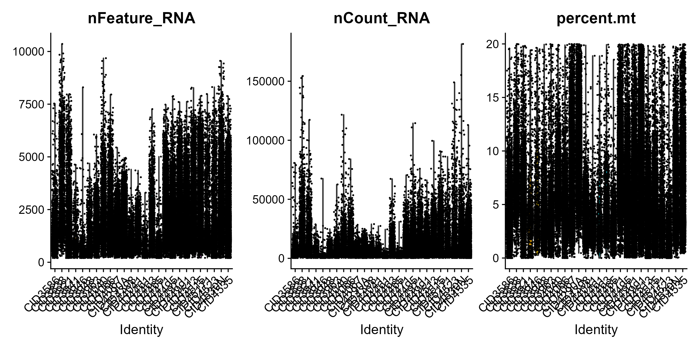
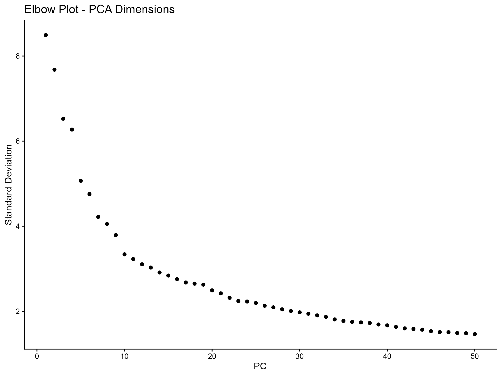
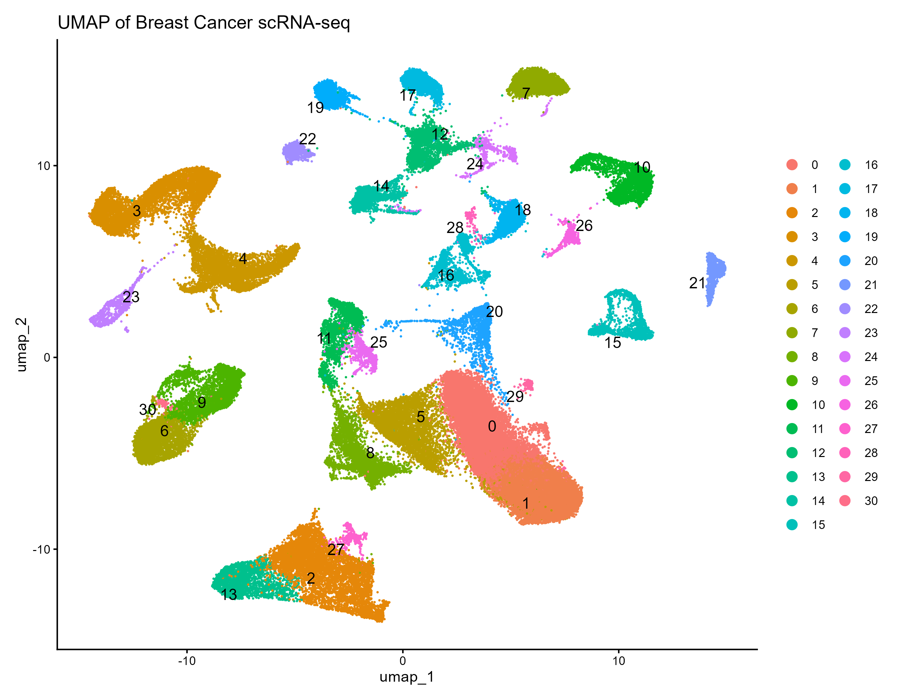
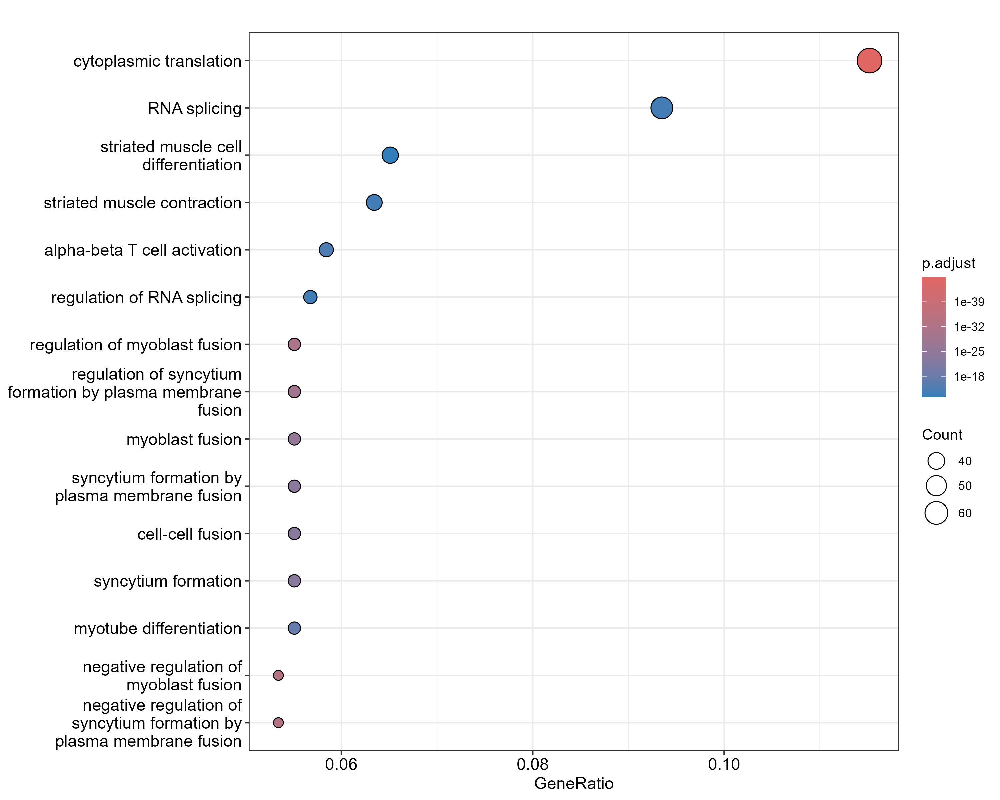
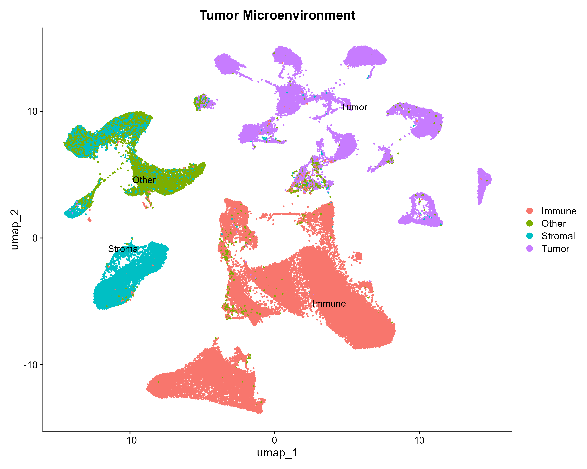
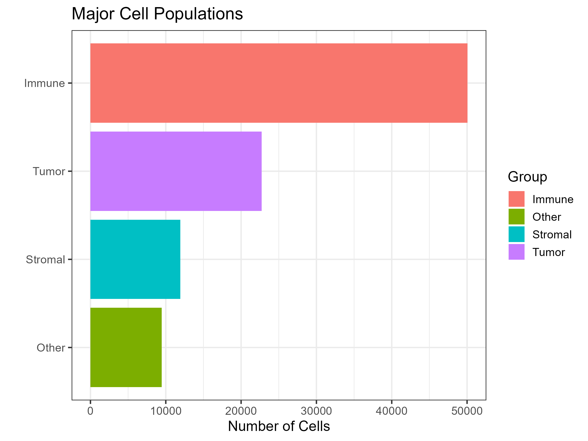

# 🧬 Single-Cell RNA-seq Analysis of Breast Cancer Tumor Microenvironment

<div align="center">


*A comprehensive single-cell RNA sequencing analysis pipeline for breast cancer using Seurat, SingleR, Gene Ontology, KEGG, Reactome, and Tumor Microenvironment characterization.*

</div>

---

## Overview

This project performs a comprehensive single-cell RNA sequencing (scRNA-seq) analysis to characterize cellular heterogeneity and the tumor microenvironment in breast cancer.

The workflow integrates quality control, dimensionality reduction, unsupervised clustering, cell type annotation, differential expression analysis, and functional pathway analysis to identify biologically meaningful cell populations and molecular signatures.

---

# Dataset

**GEO Accession:** GSE176078

**Organism:** Homo sapiens

**Disease:** Breast Cancer

**Technology:** Single-cell RNA Sequencing

Dataset contains:

* Gene expression count matrix
* Cell barcode information
* Gene annotation
* Cell metadata

Analysis was performed using R, Seurat, SingleR, and Bioconductor packages.

---

# Workflow

```
Raw scRNA-seq Data
        ↓
Quality Control & Filtering
        ↓
Normalization
        ↓
Highly Variable Gene Identification
        ↓
PCA Dimensionality Reduction
        ↓
UMAP Visualization
        ↓
Cell Clustering
        ↓
Marker Gene Identification
        ↓
Cell Type Annotation (SingleR)
        ↓
Differential Expression Analysis
        ↓
GO Enrichment
        ↓
Reactome Pathway Analysis
        ↓
Tumor Microenvironment Characterization
        ↓
Immune Landscape Analysis
```

---

# Methods

## Quality Control and Preprocessing

Cells were filtered based on:

```
nFeature_RNA > 300
nFeature_RNA < 7000
Mitochondrial percentage < 15%
```

Quality metrics evaluated:

* Number of detected genes per cell
* Total RNA counts
* Mitochondrial gene expression

<p align="center">

</p>

---

# Dimensionality Reduction and Clustering

## Principal Component Analysis (PCA)

Highly variable genes were identified followed by PCA-based dimensionality reduction.

The optimal number of principal components was selected using an elbow plot.

<p align="center">

</p>


## UMAP Visualization

Unsupervised clustering identified distinct cellular populations within the breast cancer microenvironment.

<p align="center">

</p>


---

# Cell Type Annotation

Cell identities were assigned using:

**SingleR reference-based annotation**

Identified cell populations included:

| Cell Population | Description |
|----------------|-------------|
| T Cells | Adaptive immune population |
| NK Cells | Cytotoxic lymphocytes |
| B Cells | Antibody-producing immune cells |
| Macrophages | Tumor-associated immune cells |
| Monocytes | Myeloid immune population |
| Endothelial Cells | Tumor vasculature |
| Fibroblasts | Stromal population |
| Epithelial Cells | Tumor-associated cells |


---

# Marker Gene Identification

Cluster-specific marker genes were identified using differential expression analysis.

Example markers:

| Cell Type | Representative Markers |
|-----------|-----------------------|
| T Cells | CD3D, CD3E, CD2, CCL5 |
| NK Cells | NKG7, GNLY |
| B Cells | CD79A, MS4A1 |
| Macrophages | LST1, TYROBP |
| Endothelial Cells | VWF, EMCN, PLVAP |
| Fibroblasts | COL1A1, COL3A1 |

<p align="center">

</p>


---

# Differential Expression Analysis

Cluster-specific differential expression analysis was performed to identify genes enriched in each cellular population.

Criteria:

```
Adjusted P-value < 0.05
Positive log2 Fold Change
```

Results:

| Analysis | Genes Identified |
|----------|-----------------:|
| Differentially Expressed Genes | 21,456 |


---

# Functional Enrichment Analysis

## GO Biological Process Analysis

Gene Ontology enrichment revealed pathways associated with:

* Immune activation
* Extracellular matrix organization
* Cell adhesion
* Angiogenesis
* Tumor progression


<p align="center">

</p>


---

# Tumor Microenvironment Analysis

Cells were grouped into major biological compartments:

```
Tumor Cells
      |
      |
Immune Cells
      |
      |
Stromal Cells
```

The immune landscape revealed the contribution of:

* T cells
* NK cells
* Macrophages
* B cells
* Monocytes

<p align="center">

</p>


---

# Cell Composition Analysis

Major cellular compartments were quantified to understand tumor ecosystem composition.

Example:

| Compartment | Cell Types |
|-------------|------------|
| Immune | T cells, NK cells, B cells, Macrophages |
| Stromal | Fibroblasts, Endothelial cells |
| Tumor | Epithelial cells |


<p align="center">

</p>


---

# Repository Structure

```
BreastCancer-scRNAseq/

├── data/
│
├── scripts/
│   ├── 01_Load_Data.R
│   ├── 02_QC.R
│   ├── 03_Filtering.R
│   ├── 04_Normalization.R
│   ├── 05_PCA.R
│   ├── 06_Clustering_UMAP.R
│   ├── 07_Marker_Genes.R
│   ├── 08_Cell_Annotation.R
│   ├── 09_DEG_Analysis.R
│   ├── 10_GO_KEGG.R
│   ├── 11_Reactome_Pathway.R
│   ├── 12_Marker_Heatmap.R
│   ├── 13_Marker_DotPlot.R
│   ├── 14_Cell_Composition.R
│   └── 15_TME_Analysis.R
│
├── figures/
│
├── results/
│
├── README.md
└── .gitignore
```

---

# Running the Pipeline

Install required packages:

```r
install.packages("Seurat")
install.packages("tidyverse")
install.packages("patchwork")

BiocManager::install("SingleR")
BiocManager::install("celldex")
BiocManager::install("clusterProfiler")
BiocManager::install("ReactomePA")
```

Run scripts sequentially:

```r
source("scripts/01_Load_Data.R")

source("scripts/02_QC.R")

source("scripts/03_Filtering.R")

...

source("scripts/15_TME_Analysis.R")
```

All results and figures will be generated automatically.

---

# 📚 Biological Insights

Key findings include:

- Identification of multiple immune and stromal populations.
- Characterization of the breast cancer tumor microenvironment.
- Cluster-specific marker genes associated with immune activation.
- Functional enrichment of pathways related to immune response, extracellular matrix organization, angiogenesis, and cell proliferation.

---

# 📌 Future Improvements

Potential future extensions include:

- CellChat analysis for cell-cell communication
- Monocle3 trajectory inference
- RNA velocity analysis
- Copy number variation inference
- Spatial transcriptomics integration
- Multi-omics integration

---

# 📜 Citation

If this repository contributes to your research, please consider citing the original GSE176078 dataset and the Seurat framework.

---

# 👩‍💻 Author

**Bano Rani**

BS Bioinformatics

University of Agriculture Faisalabad

Research Interests:

- Single-cell Genomics
- Cancer Bioinformatics
- Machine Learning
- Computational Biology
- AI for Precision Medicine

---

# ⭐ Support

If you find this project useful, consider giving it a ⭐ on GitHub.
