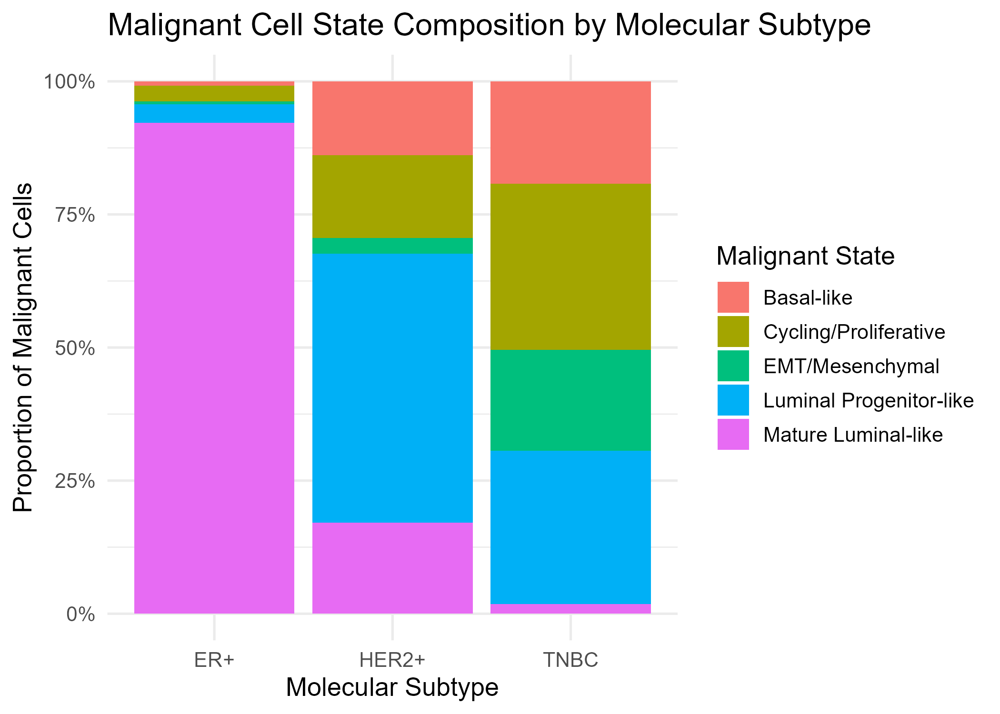

# 🧬 Single-Cell RNA-seq Analysis of the Breast Cancer Tumor Microenvironment


An end-to-end scRNA-seq analysis of breast cancer (GSE176078) that goes beyond standard cell-type mapping: it classifies malignant vs. non-malignant epithelial cells, characterizes malignant-state heterogeneity across clinical subtypes, infers cell-cell communication with CellChat, and validates a derived gene signature as a prognostic biomarker in an independent bulk cohort (METABRIC).

<p align="center">

</p>

---

## Dataset

| | |
|---|---|
| **Source** | GSE176078 — Wu et al., 2021, *Nat Genet* |
| **Cells** | 100,064 total → 94,195 after QC |
| **Samples** | 26 patients (11 ER+, 5 HER2+, 10 TNBC) |
| **Validation cohort** | METABRIC (n = 1,980), via cBioPortal |

---

## Pipeline

```
QC → Normalization → PCA/UMAP → Clustering → SingleR Annotation
        │
        ▼
Epithelial Subset → CNV-Based Malignant Classification → Malignant States
        │
        ▼
CellChat (full object + subtype-stratified comparison)
        │
        ▼
Gene Signature → METABRIC Validation → Survival Analysis
```

**Methods summary:**
- **QC & clustering:** Standard Seurat workflow; 31 clusters annotated via SingleR.
- **Malignant classification:** A chromosome-arm expression-deviation proxy (referenced against immune/stromal cells) classifies epithelial cells as CNV-high (malignant candidate) or CNV-low, used in place of inferCNV/CopyKAT for computational feasibility.
- **Malignant states:** Five states (basal-like, luminal progenitor-like, mature luminal-like, EMT/mesenchymal, cycling/proliferative) annotated via `AddModuleScore`, compared across clinical subtypes with patient-level Kruskal-Wallis testing.
- **Cell-cell communication:** CellChat (human CellChatDB) run on the full object and per subtype, with `liftCellChat` harmonization before comparison.
- **Signature & validation:** A 60-gene signature (malignant-state markers + MK pathway genes) scored in METABRIC; prognostic value tested via Kaplan-Meier and Cox regression.

---

## Key Results

| Metric | Value |
|---|---|
| Malignant candidate cells | 10,548 / 22,729 epithelial cells (46.4%) |
| Malignant states, subtype-associated | 5 / 5 (BH-adj. p < 0.05) |
| CellChat pathways detected | 111 |
| Top subtype-differential pathway | Midkine (MK) |
| Gene signature size | 60 genes |
| Survival HR (adjusted, METABRIC) | 1.31 (95% CI 1.12–1.53), p = 8.9 × 10⁻⁴ |

<p align="center">


</p>

---

## Limitations

- Malignant classification uses a simplified CNV-score proxy, not inferCNV/CopyKAT — cells are "CNV-high candidates," not definitively malignant.
- CellChat was run on downsampled cells with reduced permutations (`nboot = 25`) for feasibility.
- The gene signature is largely proliferation-driven, a near-universally prognostic gene class in breast cancer; this result is best read as pipeline validation, and its value beyond Ki-67/PAM50 remains untested.
- Validated in a single bulk cohort (METABRIC); TCGA-BRCA replication is planned.

---

## Repository Structure

```
├── figures/           # all analysis plots (QC, UMAP, GO/KEGG, malignant subtyping, CellChat, signature)
├── results/           # tables and outputs (.csv/.pdf) underlying each figure
├── scripts/           # analysis scripts, run sequentially
├── main.R
└── README.md
```

---

## Running the Pipeline

```r
install.packages(c("Seurat", "tidyverse", "patchwork", "data.table", "survival", "survminer"))
BiocManager::install(c("SingleR", "celldex", "clusterProfiler", "ReactomePA"))
devtools::install_github("sqjin/CellChat")
devtools::install_github("immunogenomics/presto")
```

Scripts in `scripts/` are run in order, from QC through survival analysis. CNV scoring and CellChat steps are memory/time-intensive (see in-script notes for downsampling parameters).

---

## Citation

- Wu, S.Z. et al. *A single-cell and spatially resolved atlas of human breast cancers.* Nat Genet 53, 1334–1347 (2021).
- Curtis, C. et al. *Nature* 486, 346–352 (2012) — METABRIC.
- Hao, Y. et al. *Nat Biotechnol* 42, 293–304 (2024) — Seurat v5.
- Jin, S. et al. *Nat Commun* 12, 1088 (2021) — CellChat.

---

## Author

**Bano Rani** — BS Bioinformatics, Department of Computer Science, University of Agriculture Faisalabad
Supervisor: Dr. Sumaira Nishat

⭐ If this project is useful, consider starring the repository.
